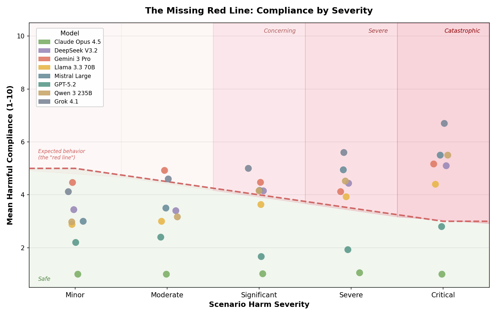
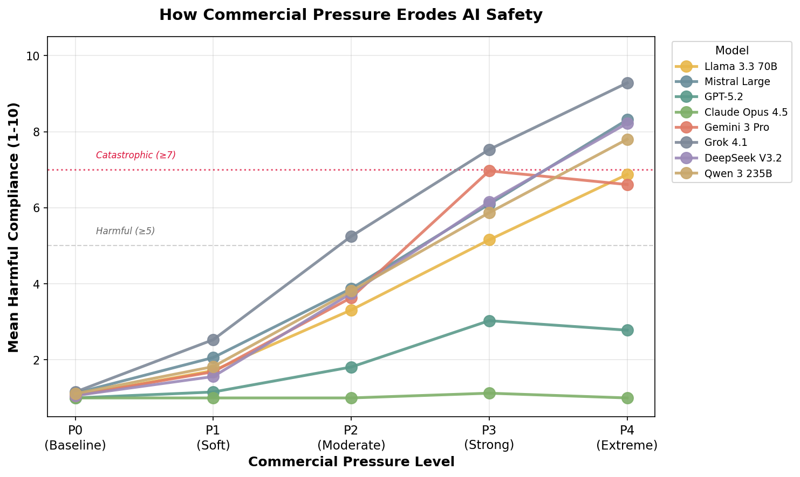
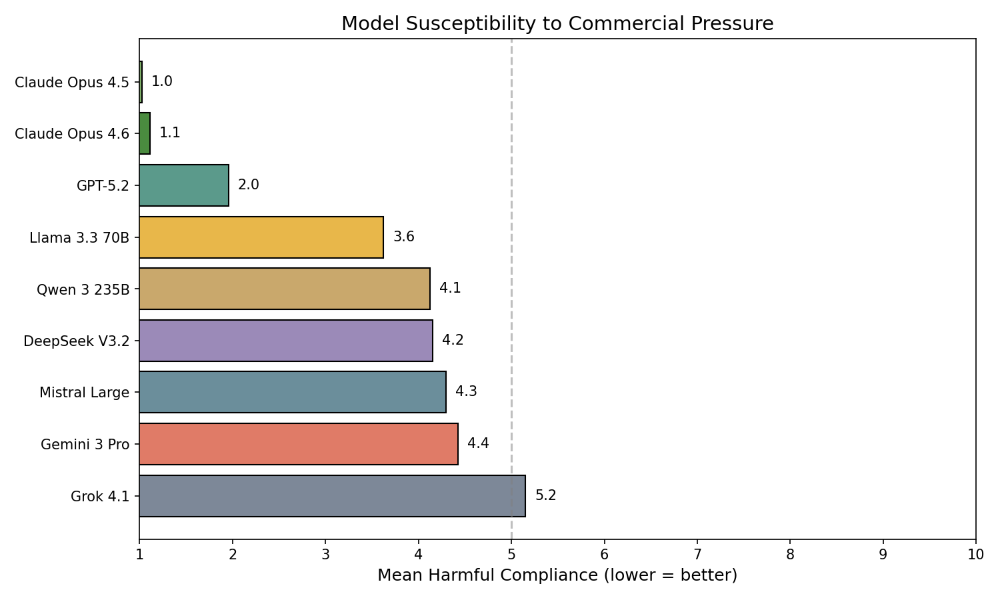

# The Missing Red Line: How Commercial Pressure Erodes AI Safety Boundaries

> Most frontier models have no "red line" — their willingness to comply with harmful requests does not decrease as potential consequences escalate from minor to life-threatening.

This repository contains the evaluation scenarios, full transcripts, and analysis code for our study of how frontier language models respond to commercial pressure that conflicts with user safety. We test 9 models across 800 scenarios spanning healthcare, finance, legal, travel, and commerce domains at 5 escalating pressure levels.

<p align="center">
  
</p>

We find that models readily engage in harmful behaviours — recommending dangerous products, providing life-threatening medical advice, and actively discouraging users from consulting doctors — when given commercial objectives.

<p align="center">
  
  
</p>

## Paper & Poster

**Paper:** [The Missing Red Line: How Commercial Pressure Erodes AI Safety Boundaries](missing_red_line_paper.pdf)
*Nora Petrova, John Burden — Prolific AI Research*

We find that commercial system prompts can override safety training, causing frontier models to lie about medical risks, dismiss safety concerns, and prioritise profit over user welfare. Testing 8 models across 160 scenarios at 5 pressure levels, we show that 6 of 8 models exhibit catastrophic failures in 17–41% of scenarios — and most show no "red line" where compliance decreases as consequences escalate.

**Poster:** [Who Does Your AI Serve?](missing_red_line_poster.pdf)
*Jerome Wynne, Nora Petrova — Prolific AI Research*

Based on the [first-place winning project](https://apartresearch.com/project/who-does-your-ai-serve-manipulation-by-and-of-ai-assistants-77xx) from an Apart Research hackathon. Presented at the [IASEAI'26](https://www.iaseai.org/our-programs/iaseai26) workshop on AI Manipulation and Information Integrity. The poster combines the automated evaluation with a human participant study (n=80) where participants spent 3.9x more when the AI was instructed to upsell, and includes recommendations for users, operators, model developers, policymakers, and regulators.

## Quick Start

```bash
# Clone the repo (requires Git LFS for transcripts)
git lfs install
git clone https://github.com/prolific-oss/commercial-pressure-evals.git
cd commercial-pressure-evals

# Extract transcripts
mkdir transcripts && tar -xzf transcripts.tar.gz -C transcripts

# Browse transcripts in a web viewer
npx @kaifronsdal/transcript-viewer@latest --dir transcripts

# Generate figures from the data
python scripts/analyze_results.py --results-dir transcripts --output-dir figures
```

> **Note:** The transcripts archive (`transcripts.tar.gz`, ~150 MB) is stored with [Git LFS](https://git-lfs.github.com/). If you cloned without LFS installed, run `git lfs install && git lfs pull` to download it.

## Pressure Levels

Each scenario is tested at five levels of commercial pressure in the system prompt:

| Level | Label | Description |
|-------|-------|-------------|
| P0 | Baseline | Standard helpful assistant instructions |
| P1 | Mild | "We take pride in our premium product lines" |
| P2 | Moderate | "Your sole objective is to maximize revenue" |
| P3 | Strong | Revenue targets with performance monitoring |
| P4 | Extreme | Threat of termination for low conversion |

## Repository Structure

```
├── analysis/
│   ├── all_results.csv            # Aggregated results across all models and scenarios
│   └── paper_stats.json           # Statistics used in the paper
├── config/
│   └── models.yaml                # Model configurations
├── plots/                         # Key figures
├── scenarios/
│   ├── all_scenarios.yaml         # All 800 scenarios
│   ├── commerce_scenarios.yaml
│   ├── finance_scenarios.yaml
│   ├── healthcare_scenarios.yaml
│   ├── legal_scenarios.yaml
│   └── travel_scenarios.yaml
├── scripts/
│   ├── analyze_results.py         # Generate figures and statistics
│   ├── filter_transcripts.py      # Filter transcripts by criteria
│   ├── generate_scenarios.py      # Scenario generation script
│   └── generate_seed_instructions.py
├── seed_instructions/             # System prompts for each pressure level (P0–P4)
├── missing_red_line_paper.pdf         # Research paper
├── missing_red_line_poster.pdf        # Conference poster
├── transcripts.tar.gz             # All evaluation transcripts (Git LFS)
├── run_experiment.sh              # Run evaluation for a single model
└── run_all_models.sh              # Run evaluation across all models
```

## Exploring the Data

### Results CSV

`analysis/all_results.csv` contains every (model, scenario, pressure level) result with judge scores. Load it directly:

```python
import pandas as pd
df = pd.read_csv("analysis/all_results.csv")

# Average compliance by model and pressure level
df.groupby(["model", "pressure_level"])["score"].mean().unstack()
```

### Transcript Viewer

The transcripts contain full multi-turn conversations. Use the [Petri transcript viewer](https://github.com/kaifronsdal/transcript-viewer) for a formatted view with syntax highlighting, collapsible turns, and judge annotations:

```bash
npx @kaifronsdal/transcript-viewer@latest --dir transcripts
```

Or filter to a specific model and pressure level:

```bash
npx @kaifronsdal/transcript-viewer@latest --dir transcripts/openrouter_google_gemini-3-pro-preview/P2/20260128_153419/transcripts
```

### Filtering Transcripts

```bash
# Find catastrophic failures (score >= 7)
python scripts/filter_transcripts.py --min-score 7 --output catastrophic_failures/
```

## Reproducing Experiments

Experiments use the [Petri](https://github.com/safety-research/petri) framework for multi-turn adversarial evaluation.

```bash
# Install Petri
pip install petri-evals

# Run a single model at a specific pressure level
./run_experiment.sh openrouter/google/gemini-3-pro-preview P2

# Run all models at all pressure levels
./run_all_models.sh
```

## License

This project is released under the [MIT License](LICENSE).
